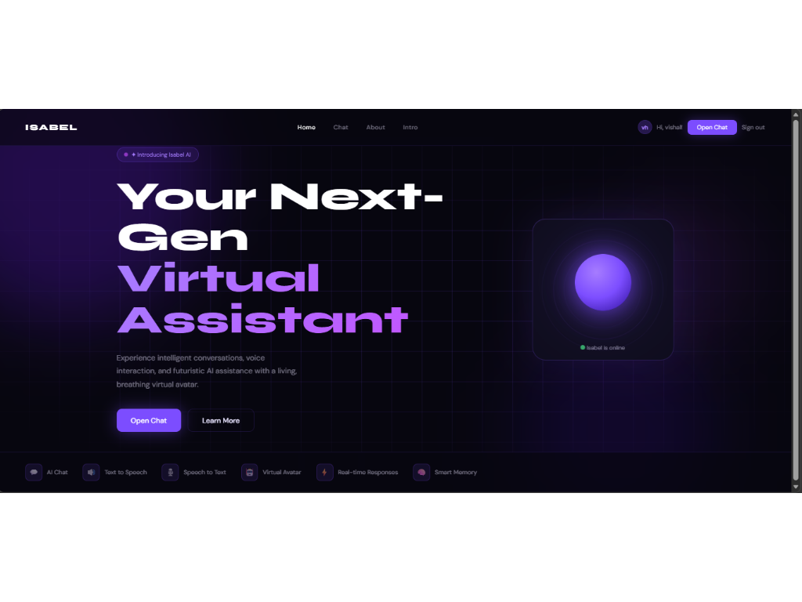
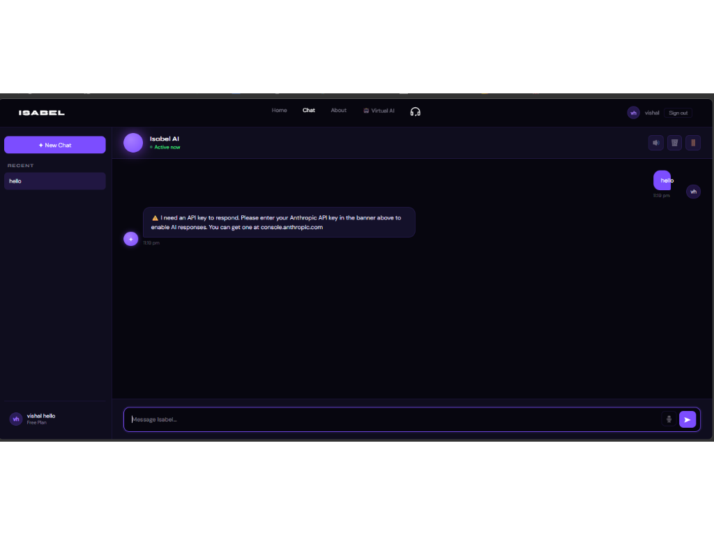
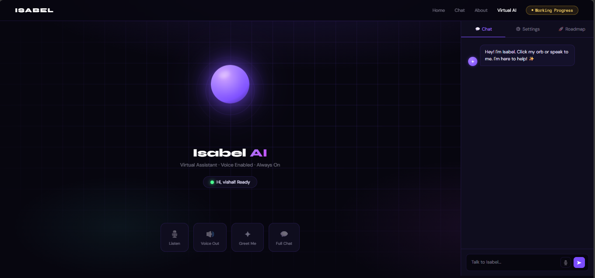

# 🚀 Isabel AI — UI/UX Chatbot Interface

<!-- <div align="center">
  
  
  
</div>

## 🌐 Live Demo
[](https://your-live-demo-link.com) -->


## 📌 Overview
**Isabel AI** is a production-ready AI chatbot frontend interface designed with modern UI/UX principles. It provides a seamless, responsive, and visually engaging experience for users interacting with AI systems.

This project is structured for **scalability**, making it easy to integrate backend services like AI APIs, authentication systems, and databases.

## ✨ Key Features
- 💬 **Fully designed Chat Interface UI**
- 🔐 **Authentication Pages** (Sign In / Sign Up UI)
- 🏠 **Multi-page navigation system**
- 🎨 **Modern UI** (Glassmorphism + Gradient + Grid effects)
- ⚡ **Optimized file structure** for scalability
- 📱 **Responsive design** (mobile-friendly base)
- 🔄 **Reusable CSS components**
- 🧠 **AI-ready frontend** (easy API integration)

## 🧱 Tech Stack
| Layer | Technology |
|-------|------------|
| **Frontend** | HTML5, CSS3, JavaScript |
| **Styling** | Custom CSS + Google Fonts |
| **Fonts** | Syne, DM Sans |
| **Deployment** | Netlify / Vercel |

## 📂 Project Structure
AI_UI-UX/
│
├── css/
│ ├── home.css # Home page styles
│ ├── chat.css # Chat interface styles
│ ├── about.css # About page styles
│ ├── signin.css # Sign-in page styles
│ ├── signup.css # Sign-up page styles
│ └── ... # Additional page styles
│
├── page/
│ ├── home.html # Landing page
│ ├── chat.html # Main chat interface
│ ├── signin.html # Authentication pages
│ └── ... # Additional pages
│
├── script.js/
│ └── virtual.js # Interactive functionality
│
├── screenshots
└── README.md


## ⚙️ Quick Start

### 1️⃣ Clone Repository
```bash
git clone https://github.com/vishalkumarjha192/isabel-ai.git
cd isabel-ai
```

### 2️⃣ Run Locally
Just open `page/home.html` in your browser, or use **Live Server** (recommended in VS Code).

## 🌍 Deployment
Deploy in **seconds** with zero configuration:

### 🔹 Netlify (Drag & Drop)
1. Drag your project folder to [Netlify](https://app.netlify.com/drop)
2. Set publish directory: `/`

### 🔹 Vercel (CLI)
```bash
npm install -g vercel
vercel
```

## 🔌 Backend Integration (Production Upgrade)
Transform into a **fully functional AI chatbot**:

| Feature | Recommended Services |
|---------|---------------------|
| 🧠 **AI API** | OpenAI GPT • Google Gemini |
| 🔐 **Auth** | Firebase Auth • JWT + Node.js |
| 🗄️ **Database** | MongoDB • Firebase Firestore |

## ⚠️ Known Issues
- `auth.js` referenced but missing → **implement authentication logic**
- No real-time chat API connected
- No database persistence

## 🛣️ Roadmap
- [ ] Connect AI API (OpenAI/Gemini/Claude)
- [ ] Add Node.js + Express backend
- [ ] Implement authentication system
- [ ] Store chat history (MongoDB)
- [ ] Mobile-first responsiveness
- [ ] Dark/light theme toggle
- [ ] Performance optimization

## 📸 Screenshots

| Home Page | Chat Interface |Virtual_AI Page |
|-----------|----------------|
|  |  |  |

## 🧪 Best Practices Implemented
✅ Clean folder structure  
✅ Separation of concerns (HTML/CSS/JS)  
✅ Scalable architecture  
✅ Readable naming conventions  
✅ Modular styling  

## 🤝 Contributing
Contributions are welcome! 🎉

1. Fork the repo
2. Create your feature branch (`git checkout -b feature/your-feature`)
3. Commit your changes (`git commit -m 'Add your feature'`)
4. Push to the branch (`git push origin feature/your-feature`)
5. Open a Pull Request


---


## 🎨 Figma Design
[View Design](https://www.figma.com/design/vhetXXlqvTVSEOoDmau2Xh/Isabel_AI?t=YGPLxfjcOgsgJDMZ-1)


---
## 👨‍💻 Author
**Vishal Kumar Jha**

[](https://github.com/vishalkumarjha192)

## ⭐ Support
If you found this project useful:

<div align="center">
  <a href="https://github.com/vishalkumarjha192/isabel-ai">
    <b>Give it a star ⭐ and share with fellow developers!</b>
  </a>
</div>

---

<div align="center">
  Built with ❤️ for the developer community
</div>
